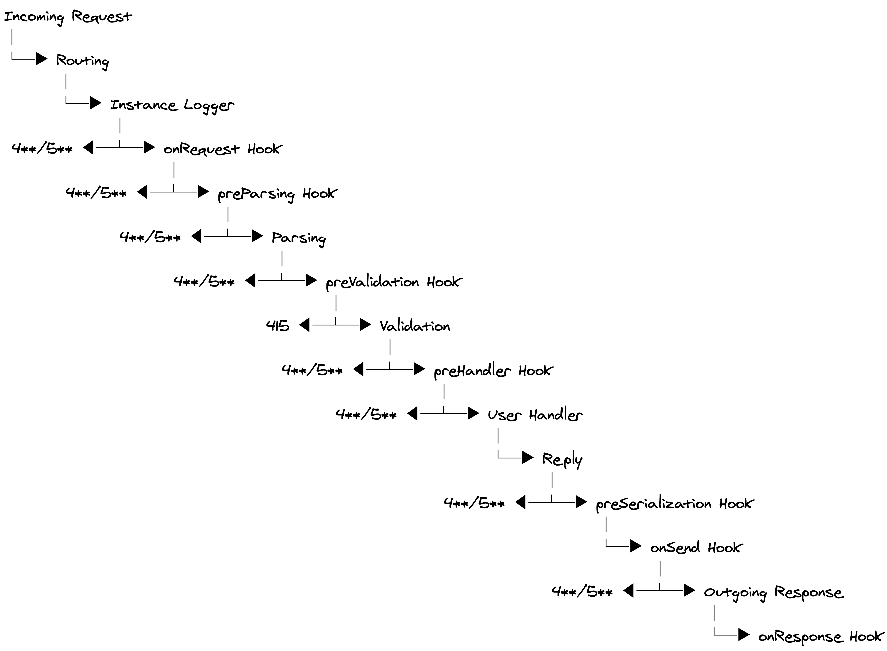
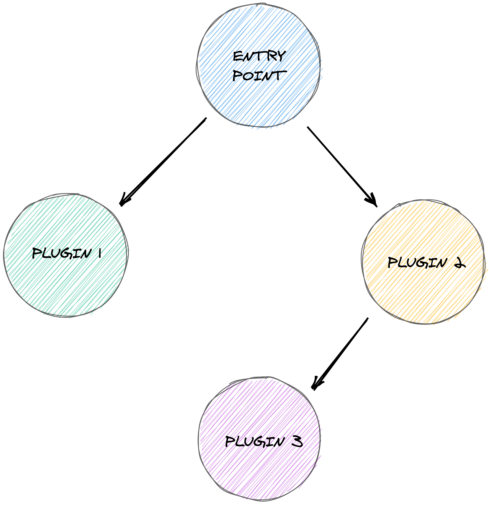
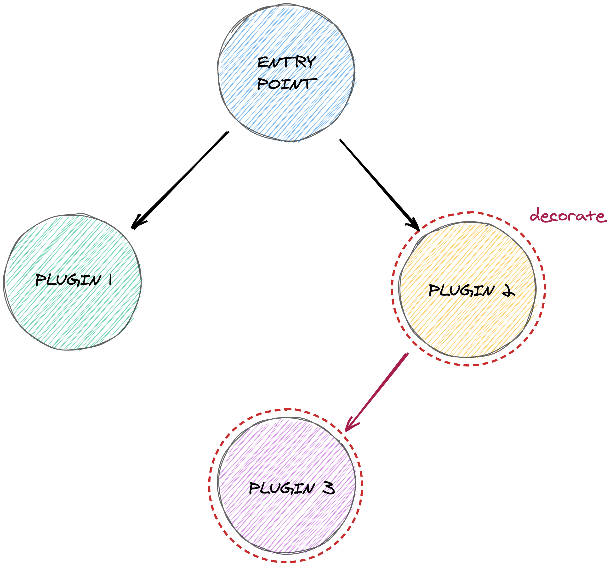
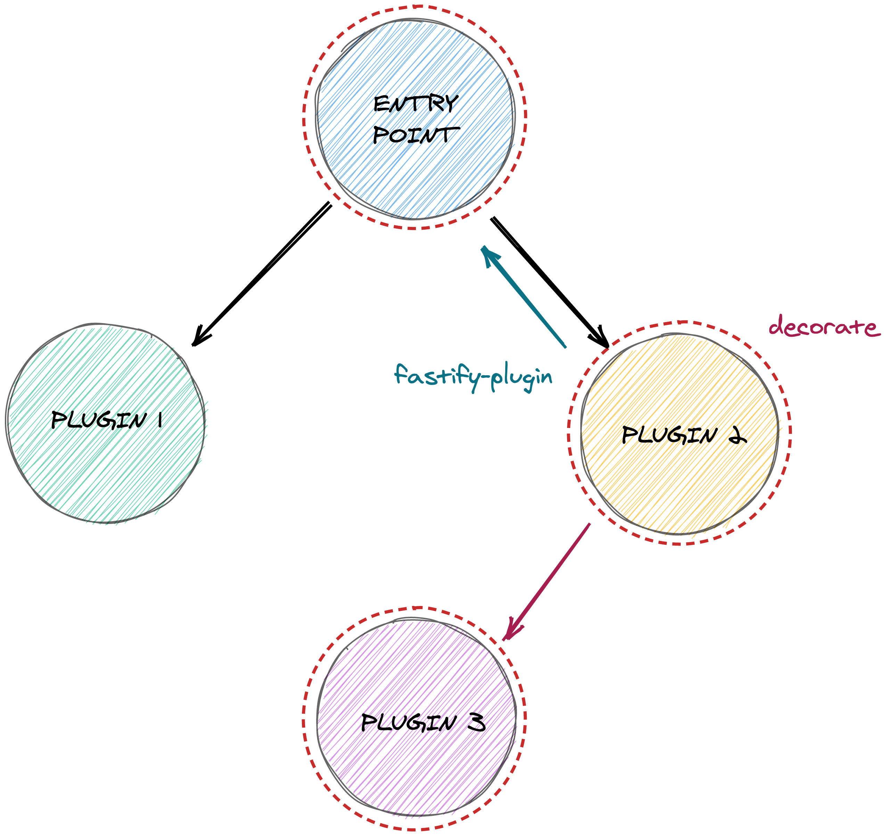
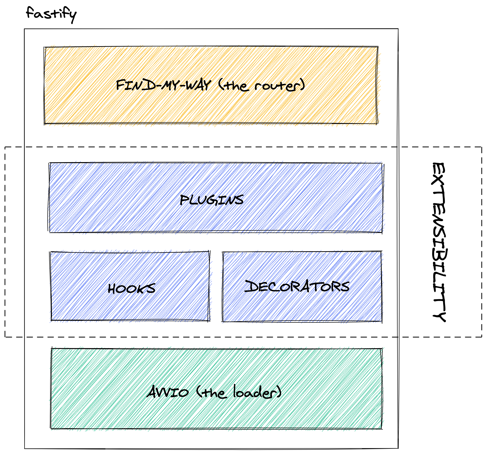
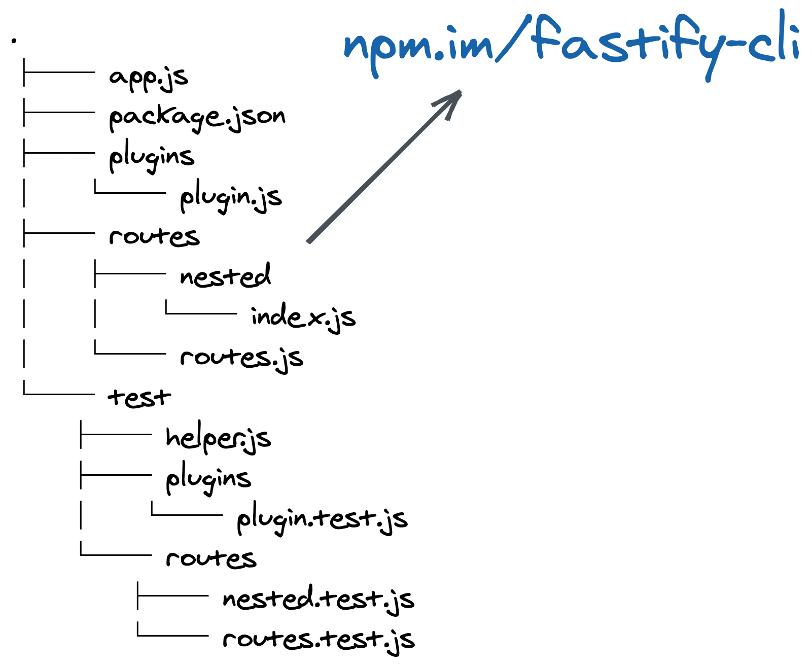
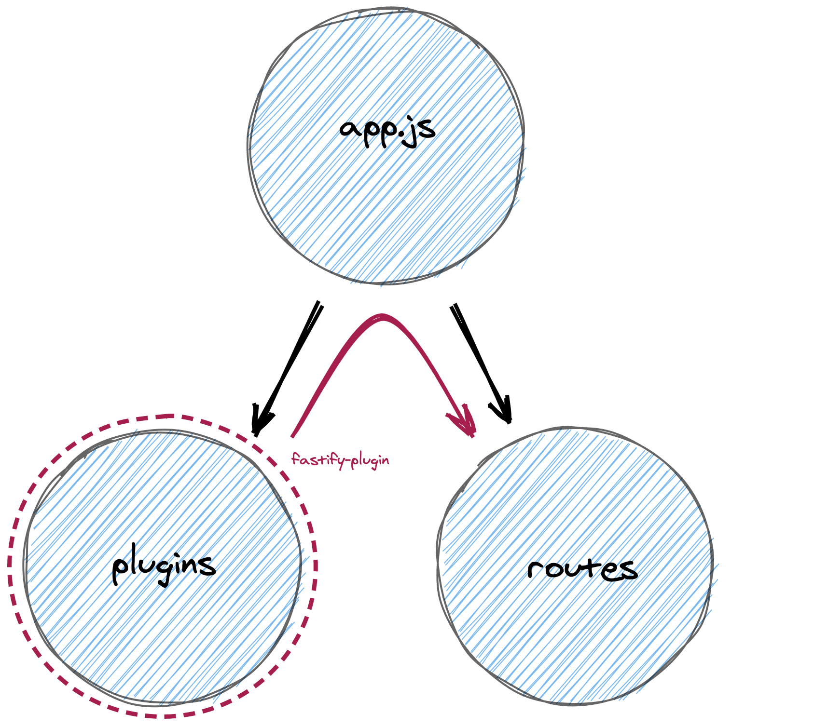
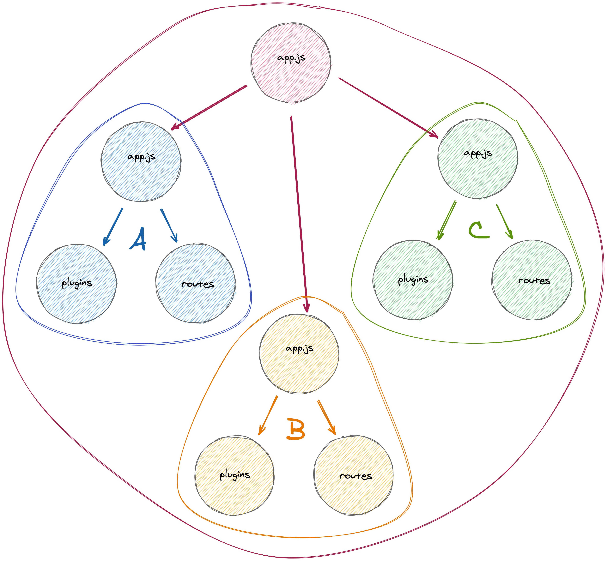

footer: [@delvedor](https://twitter.com/delvedor)
slidenumbers: true

# [fit] Fastify 101

---

# Who am I?

Tomas Della Vedova
Senior Software Engineer @ [Elastic](https://www.elastic.co)

- [fastify](https://github.com/fastify/fastify)
- [fast-json-stringify](https://github.com/fastify/fast-json-stringify)
- [find-my-way](https://github.com/delvedor/find-my-way)
- [elasticsearch-js](https://github.com/elastic/elasticsearch-js)

---


[.footer: [fastify.io](https://fastify.io)]

---

[.footer: [fastify.io/docs/latest/Server](https://www.fastify.io/docs/latest/Server/)]

# Let's create a basic server

---

```js
import Fastify from 'fastify'

const fastify = Fastify()

fastify.listen(3000, console.log)
```

---

```sh
▶ curl -v localhost:3000
*   Trying 127.0.0.1...
* TCP_NODELAY set
* Connected to localhost (127.0.0.1) port 3000 (#0)
> GET / HTTP/1.1
> Host: localhost:3000
> User-Agent: curl/7.64.1
> Accept: */*
>
< HTTP/1.1 404 Not Found
< content-type: application/json; charset=utf-8
< content-length: 72
< Date: Wed, 02 Dec 2020 10:47:22 GMT
< Connection: keep-alive
< Keep-Alive: timeout=5
<
* Connection #0 to host localhost left intact
{"message":"Route GET:/ not found","error":"Not Found","statusCode":404}* Closing connection 0
```

---

[.footer: [fastify.io/docs/latest/Routes](https://www.fastify.io/docs/latest/Routes/)]

# Our first route

---

[.column]
[.code-highlight: 5-8, 10-17]

```js
import Fastify from 'fastify'

const fastify = Fastify()

// shorthand declaration
fastify.get('/', async (req, reply) => {
  return { hello: 'world' }
})

// full declaration
fastify.route({
  method: 'GET',
  path: '/',
  handler: async (req, reply) => {
    return { hello: 'world' }
  }
})

fastify.listen(3000, console.log)
```

[.column]
[.code-highlight: 5-8, 10-17]

```js
import Fastify from 'fastify'

const fastify = Fastify()

// shorthand declaration
fastify.get('/', (req, reply) => {      
  reply.send({ hello: 'world' })
})

// full declaration
fastify.route({
  method: 'GET',
  path: '/',
  handler: (req, reply) => {
    reply.send({ hello: 'world' })
  }
})

fastify.listen(3000, console.log)
```

---

```sh
▶ curl -v localhost:3000
*   Trying 127.0.0.1...
* TCP_NODELAY set
* Connected to localhost (127.0.0.1) port 3000 (#0)
> GET / HTTP/1.1
> Host: localhost:3000
> User-Agent: curl/7.64.1
> Accept: */*
>
< HTTP/1.1 200 OK
< content-type: application/json; charset=utf-8
< content-length: 17
< Date: Wed, 02 Dec 2020 10:52:35 GMT
< Connection: keep-alive
< Keep-Alive: timeout=5
<
* Connection #0 to host localhost left intact
{"hello":"world"}* Closing connection 0
```

---

[.code-highlight: 5-7]

```js
import Fastify from 'fastify'

const fastify = Fastify()

fastify.get('/hello/:name', async (req, reply) => {
  return req.params.name
})

fastify.listen(3000, console.log)
```

---

```sh
▶ curl -v localhost:3000/hello/tomas
*   Trying 127.0.0.1...
* TCP_NODELAY set
* Connected to localhost (127.0.0.1) port 3000 (#0)
> GET /hello/tomas HTTP/1.1
> Host: localhost:3000
> User-Agent: curl/7.64.1
> Accept: */*
>
< HTTP/1.1 200 OK
< content-type: text/plain; charset=utf-8
< content-length: 5
< Date: Wed, 02 Dec 2020 10:54:57 GMT
< Connection: keep-alive
< Keep-Alive: timeout=5
<
* Connection #0 to host localhost left intact
tomas* Closing connection 0
```

---

[.code-highlight: 5-7]

```js
import Fastify from 'fastify'

const fastify = Fastify()

fastify.get('/public/*', async (req, reply) => {
  return req.params['*']
})

fastify.listen(3000, console.log)
```

---

```sh
▶ curl -v localhost:3000/public/styles/login.css
*   Trying 127.0.0.1...
* TCP_NODELAY set
* Connected to localhost (127.0.0.1) port 3000 (#0)
> GET /public/styles/login.css HTTP/1.1
> Host: localhost:3000
> User-Agent: curl/7.64.1
> Accept: */*
>
< HTTP/1.1 200 OK
< content-type: text/plain; charset=utf-8
< content-length: 16
< Date: Wed, 02 Dec 2020 10:56:01 GMT
< Connection: keep-alive
< Keep-Alive: timeout=5
<
* Connection #0 to host localhost left intact
styles/login.css* Closing connection 0
```

---

[.code-highlight: 8, 10, 17, 19]

```js
import Fastify from 'fastify'

const fastify = Fastify()

fastify.route({
  method: 'GET',
  path: '/',
  version: '1.0.0',
  handler: async (req, reply) => {
    return { hello: 'world' }
  }
})

fastify.route({
  method: 'GET',
  path: '/',
  version: '2.0.0',
  handler: async (req, reply) => {
    return { ciao: 'mondo' }
  }
})

fastify.listen(3000, console.log)
```

---

```sh
▶ curl -H 'Accept-Version: 1.0.0' localhost:3000
{"hello":"world"}%


▶ curl -H 'Accept-Version: 2.0.0' localhost:3000
{"ciao":"mondo"}% 


▶ curl -H 'Accept-Version: 3.0.0' localhost:3000
{"message":"Route GET:/ not found","error":"Not Found","statusCode":404}% 


▶ curl -H 'Accept-Version: 1.x' localhost:3000
{"hello":"world"}%


▶ curl -H 'Accept-Version: 2.1.x' localhost:3000
{"message":"Route GET:/ not found","error":"Not Found","statusCode":404}%

▶ curl localhost:3000
{"message":"Route GET:/ not found","error":"Not Found","statusCode":404}%
```

---

[.code-highlight: 3, 4-8]

```js
import Fastify from 'fastify'

const fastify = Fastify({ caseSensitive: false })

fastify.get('/user/:username', async (req, reply) => {
  return req.params.username
})

fastify.listen(3000, console.log)
```

---

```sh
▶ curl localhost:3000/user/tomas
tomas%


▶ curl localhost:3000/USER/tomas
tomas%

# with `caseSensitive: true` (default)
▶ curl localhost:3000/USER/tomas
{"message":"Route GET:/USER/tomas not found","error":"Not Found","statusCode":404}%
```

---

[.footer: [fastify.io/docs/latest/Validation-and-Serialization](https://www.fastify.io/docs/latest/Validation-and-Serialization/)]

# Data validation
### Never trust external input

---

[.code-highlight: 6-15]

```js
import Fastify from 'fastify'

const fastify = Fastify()

fastify.post('/hello', {
  schema: {
    body: {
      type: 'object',
      properties: {
        name: { type: 'string' }
      },
      additionalProperties: false,
      required: ['name']
    }
  }
}, async (req, reply) => {
  return { hello: req.body.name }
})


fastify.listen(3000, console.log)
```

---

```sh
▶ curl \
  -X POST \
  -H 'Content-Type: application/json' \
  -d '{"name":"tomas"}' \
  localhost:3000/hello
{"hello":"tomas"}%


▶ curl \
  -X POST \
  -H 'Content-Type: application/json' \
  -d '{"foo":"bar"}' \
  localhost:3000/hello
{"statusCode":400,"error":"Bad Request","message":"body should have required property 'name'"}%
```

---

[.code-highlight: 2, 7-11]

```js
import Fastify from 'fastify'
import S from 'fluent-schema'

const fastify = Fastify()

fastify.post('/hello', {
  schema: {
    body: S.object()
      .additionalProperties(false)
      .prop('name', S.string().required())
  }
}, async (req, reply) => {
  return { hello: req.body.name }
})

fastify.listen(3000, console.log)
```

---

```sh
▶ curl \
  -X POST \
  -H 'Content-Type: application/json' \
  -d '{"name":"tomas"}' \
  localhost:3000/hello
{"hello":"tomas"}%


▶ curl \
  -X POST \
  -H 'Content-Type: application/json' \
  -d '{"foo":"bar"}' \
  localhost:3000/hello
{"statusCode":400,"error":"Bad Request","message":"body should have required property 'name'"}%
```

---

[.footer: [fastify.io/docs/latest/Validation-and-Serialization](https://www.fastify.io/docs/latest/Validation-and-Serialization/)]

# Serialization
### Built for speed

---

```js
import fastJson from 'fast-json-stringify'

const stringify = fastJson({
  type: 'object',
  properties: {
    firstName: { type: 'string' },
    lastName: { type: 'string' },
    age: { type: 'integer' }
  }
})

console.log(stringify({
  firstName: 'Tomas',
  lastName: 'Della Vedova',
  age: 27
}))
```
---

[.code-highlight: 9, 13-17]

```js
import Fastify from 'fastify'
import S from 'fluent-schema'

const fastify = Fastify()

fastify.route({
  method: 'POST',
  path: '/hello',
  schema: {
    body: S.object()
      .additionalProperties(false)
      .prop('name', S.string().required())
    response: {
      200: S.object()
        .prop('hello', S.string())
    }
  },
  handler: async (req, reply) => {
    return { hello: req.body.name }
  }
})

fastify.listen(3000, console.log)
```

---

[.code-highlight: 10-13, 16-19]

```js
import Fastify from 'fastify'
import S from 'fluent-schema'

const fastify = Fastify()

fastify.route({
  method: 'GET',
  path: '/',
  schema: {
    response: {
      200: S.object()
        .prop('firstName', S.string())
    }
  },
  handler: async (req, reply) => {
    return {
      firstName: 'Tomas',
      lastName: 'Della Vedova' // this will not be present in the response
    }
  }
})

fastify.listen(3000, console.log)
```

---

[.footer: [fastify.io/docs/latest/Hooks](https://www.fastify.io/docs/latest/Hooks/)]

# Hooks
### Interact with the request response lifecycle

---



---

[.column]
[.code-highlight: 5-7]

```js
import Fastify from 'fastify'

const fastify = Fastify()

fastify.addHook('onRequest', async (req, reply) => {
  console.log('incoming request')
})

fastify.get('/', async (req, reply) => {
  return { hello: 'world' }
})

fastify.listen(3000, console.log)
```

[.column]
[.code-highlight: 5-7]

```js
import Fastify from 'fastify'

const fastify = Fastify()

fastify.addHook('onRequest', (req, reply, done) => {
  console.log('incoming request')
  done()
})

fastify.get('/', (req, reply) => {
  reply.send({ hello: 'world' })
})

fastify.listen(3000, console.log)
```

---

[.code-highlight: 8-10]

```js
import Fastify from 'fastify'

const fastify = Fastify()

fastify.route({
  method: 'GET',
  path: '/',
  onRequest: async (req, reply) => {
    console.log('incoming request')
  },
  handler: async (req, reply) => {
    return { hello: 'world' }
  }
})

fastify.listen(3000, console.log)
```

---

[.footer: [fastify.io/docs/latest/Decorators](https://www.fastify.io/docs/latest/Decorators/)]

# Decorators
### Enhancing the framework

---

[.code-highlight: 6, 12-13, 16-19]

```js
import Fastify from 'fastify'
import S from 'fluent-schema'

const fastify = Fastify()

fastify.decorate('repeat', (str, times) => str.repeat(times))

fastify.route({
  method: 'GET',
  path: '/repeat/:string',
  schema: {
    params: S.object().prop('string', S.string()),
    query: S.object().prop('times', S.number().default(1))
  },
  handler: async (req, reply) => {
    return fastify.repeat(
      req.params.string,
      req.query.times
    )
  }
})

fastify.listen(3000, console.log)
```

---

```sh
▶ curl localhost:3000/repeat/choo
choo%

▶ curl localhost:3000/repeat/choo?times=2
choochoo%

▶ curl localhost:3000/repeat/choo?times=three
{"statusCode":400,"error":"Bad Request","message":"querystring.times should be number"}
```

---

[.code-highlight: 15-16]

```js
import Fastify from 'fastify'
import S from 'fluent-schema'

const fastify = Fastify()

fastify.decorate('repeat', (str, times) => str.repeat(times))

fastify.route({
  method: 'GET',
  path: '/repeat/:string',
  schema: {
    params: S.object().prop('string', S.string()),
    query: S.object().prop('times', S.number().default(1))
  },
  handler: async function (req, reply) {
    return this.repeat(
      req.params.string,
      req.query.times
    )
  }
})

fastify.listen(3000, console.log)
```

---

[.code-highlight: 8, 12]

```js
import Fastify from 'fastify'
import S from 'fluent-schema'
import authenticate from './my-auth-logic.js'

const fastify = Fastify()

fastify.addHook('onRequest', async (req, reply) => {
  req.user = await authenticate(req)
})

fastify.get('/whoami', async (req, reply) => {
  return req.user
})

fastify.listen(3000, console.log)
```

---

[.code-highlight: 7, 10, 14]

```js
import Fastify from 'fastify'
import S from 'fluent-schema'
import authenticate from './my-auth-logic.js'

const fastify = Fastify()

fastify.decorateRequest('user', null)

fastify.addHook('onRequest', async (req, reply) => {
  req.user = await authenticate(req)
})

fastify.get('/whoami', async (req, reply) => {
  return req.user
})

fastify.listen(3000, console.log)
```

---

[.footer: [fastify.io/docs/latest/Plugins](https://www.fastify.io/docs/latest/Plugins/)]

# Plugins
### The building blocks of Fastify

---

```js
export default async function ThisIsAPlugin (fastify, options) {

}


export default function ThisIsAPlugin (fastify, options, done) {
  done()
}
```

---

[.code-highlight: 2-4]

```js
export default async function ThisIsAPlugin (fastify, options) {
  fastify.get('/', async (req, reply) => {
    return { hello: 'world' }
  })
}
```

---

[.code-highlight: 2-4]

```js
export default async function ThisIsAPlugin (fastify, options) {
  fastify.addHook('onRequest', async (req, reply) => {
    console.log('incoming request')
  })

  fastify.get('/', async (req, reply) => {
    return { hello: 'world' }
  })
}
```

---

[.code-highlight: 2]

```js
export default async function ThisIsAPlugin (fastify, options) {
  fastify.decorate('repeat', (str, times) => str.repeat(times))

  fastify.addHook('onRequest', async (req, reply) => {
    console.log('incoming request')
  })

  fastify.get('/', async (req, reply) => {
    return { hello: 'world' }
  })
}
```

---

[.code-highlight: 2, 6-8]

```js
import Fastify from 'fastify'
import MyPlugin from './my-plugins.js'

const fastify = Fastify()

fastify.register(MyPlugin)
// but also
fastify.register(import('./my-plugins.js'))

fastify.listen(3000, console.log)
```

---

[.footer: [fastify.io/docs/latest/Plugins](https://www.fastify.io/docs/latest/Plugins/)]

# Plugins
### Encapsulation

---

```js
// main.js
fastify.register(import('./plugin.js'))
fastify.register(import('./other-plugin.js'))

// plugin.js
export default async function Repeat (fastify, options) {
  fastify.decorate('repeat', (str, times) => str.repeat(times))
}

// other-plugin.js
export default async function Other (fastify, options) {
  console.log(fastify.repeat) // undefined
}
```

---



---



---

[.code-highlight: 6, 10, 14]

```js
// main.js
fastify.register(import('./plugin.js'))
fastify.register(import('./other-plugin.js'))

// plugin.js
import fp from 'fastify-plugin'
async function Repeat (fastify, options) {
  fastify.decorate('repeat', (str, times) => str.repeat(times))
}
export default fp(MyRoutes)

// other-plugin.js
export default async function Other (fastify, options) {
  console.log(fastify.repeat) // Function
}
```

---



---

```js
import RoutesV1 from './routes/v1.js'
import RoutesV2 from './routes/v2.js'

fastify.register(RoutesV1, {
  prefix: '/v1',
  logLevel: 'error'
})

fastify.register(RoutesV2, {
  prefix: '/v2',
  logLevel: 'debug'
})
```

---

[.footer: [fastify.io/docs/latest/Logging](https://www.fastify.io/docs/latest/Logging/)]

# Logging

---

[.code-highlight: 3, 6]

```js
import Fastify from 'fastify'

const fastify = Fastify({ logger: true })

fastify.get('/', async (req, reply) => {
  req.log.info('Hello!')
  return { hello: 'world' }
})

fastify.listen(3000)
```

---

```sh
▶ node index.js

{"level":30,"time":1606910065312,"pid":16847,"hostname":"skadi.local",
  "msg":"Server listening at http://127.0.0.1:3000"}

{"level":30,"time":1606910067203,"pid":16847,"hostname":"skadi.local",
  "reqId":1,"req":{"method":"GET","url":"/","hostname":"localhost:3000",
  "remoteAddress":"127.0.0.1","remotePort":63754},"msg":"incoming request"}

{"level":30,"time":1606910067207,"pid":16847,"hostname":"skadi.local",
  "reqId":1,"res":{"statusCode":200},"responseTime":3.6735079288482666,
  "msg":"request completed"}
```

---

# Putting all together

---



---



---



---



---

# A complete App

---

# [fastify.io/docs](https://www.fastify.io/docs/)

---

# [fastify.io/ecosystem](https://www.fastify.io/ecosystem/)

---

# [fastify.io/contribute](https://www.fastify.io/contribute/)

---

# [fit] [github.com/delvedor/fastify-101](https://github.com/delvedor/fastify-101)

---

[.hide-footer]
# Thanks!
### [@delvedor](https://twitter.com/delvedor)
