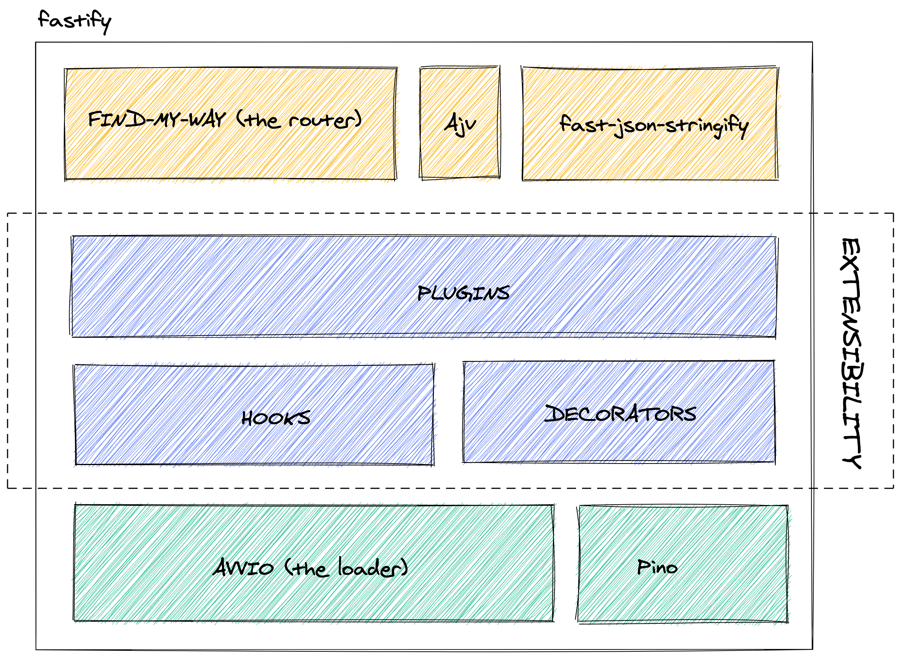

footer: [@delvedor](https://twitter.com/delvedor)

# [fit] Fastify 101

---

# Who am I?

Tomas Della Vedova
Senior Software Engineer @ [Elastic](https://www.elastic.co)

- [fastify](https://github.com/fastify/fastify)
- [fast-json-stringify](https://github.com/fastify/fast-json-stringify)
- [find-my-way](https://github.com/delvedor/find-my-way)
- [elasticsearch-js](https://github.com/elastic/elasticsearch-js)

---

[.footer: [fastify.io](https://fastify.io)]

---

# Let's create a basic server

---

# Our first route

---

# Data validation
### Never trust external input

---

# Serialization
### Built for speed

---

# Hooks
### Interact with the request response lifecycle

---

---

# Decorators
### Enhancing the framework

---

# Plugins
### The building blocks of Fastify

---

---

---

---

# Putting all together

---

---

# A complete App

---

# Thanks!
